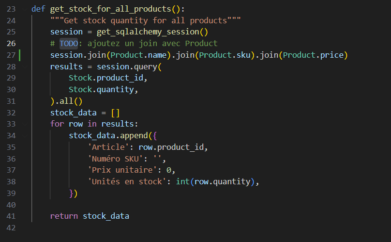

# Labo 03 — Rapport

 \
Thomas Tellier \
Rapport de laboratoire \
LOG430 — Architecture logicielle \
Montréal, 3 octobre 2025 \
École de technologie supérieure

## Questions

### Question 1

Quel nombre d'unités de stock pour votre article avez-vous obtenu à la fin du test ? Et pour l'article avec id=2 ? Veuillez inclure la sortie de votre Postman pour illustrer votre réponse.

Le nombre d'unité est de 5 à la fin du test. Pour l'article avec id=2, quantity = 500

### Question 2

Décrivez l'utilisation de la méthode join dans ce cas. Utilisez les méthodes telles que décrites à Simple Relationship Joins et Joins to a Target with an ON Clause dans la documentation SQLAlchemy pour ajouter les colonnes demandées dans cette activité. Veuillez inclure le code pour illustrer votre réponse.

Ici, nous avons utiliser la méthode join avec simple relationm pour ajouter des colones avec au sqlAlchemySession. 

### Question 3

Quels résultats avez-vous obtenus en utilisant l’endpoint POST /stocks/graphql avec la requête suggérée ? Veuillez joindre la sortie de votre requête dans Postman afin d’illustrer votre réponse

## Observations additionnelles

- Observations sur d’éventuels problèmes de setup ou de code rencontrés lors de l’exécution des activités (optionel).
- Particularités de votre configuration CI/CD (ex. : utilisation d’une VM, d’un service infonuagique comme Azure, etc.).
